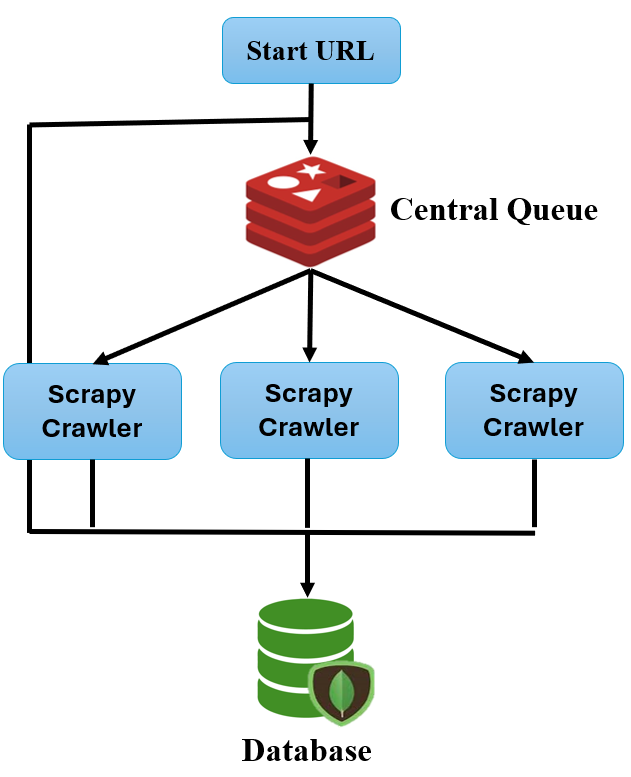

# Rent House Crawler

<p align="center">
  
</p>

## Description

This is a distributed web crawler using Scrapy, Redis, and Selenium. It is designed to handle various types of websites, including static, AJAX, and dynamic pages. By leveraging a distributed setup with docker compose, the system can be deployed across multiple machines to enhance crawling speed and efficiency.

**Note:**

- ddroom -> Ajax

- housefun -> dynamic (with selenium)

- rakuya -> static

### Architecture Overview:

The architecture features a central queue managed by Redis, which distributes tasks to multiple Scrapy crawlers. The crawlers process the tasks and store the collected data in MongoDB.

## Prerequest

There is no MongoDB container in the docker-compose. You need to rewrite the docker-compose or set up MongoDB locally.

1. Setup MonogoDB locally or modify the docker-compose.
2. Adjust the environment variable to make the project find your MongoDB database.

## Install

There are two ways to set up.

1. local set up

   1. Pip install
      ```python
      pip install -r requirements.txt
      ```
   2. Push url to the redis
   3. scrapy crawl [ddroom/housefun/rakuya]

2. Adopt the docker-compose

   1. Build the docker image
      ```docker
      docker build -t scrapy_rent_crawler .
      ```
   2. Run the docker compose
      ```docker
      docker compose up -d
      ```
      if want to debug, remove the -d flag.
